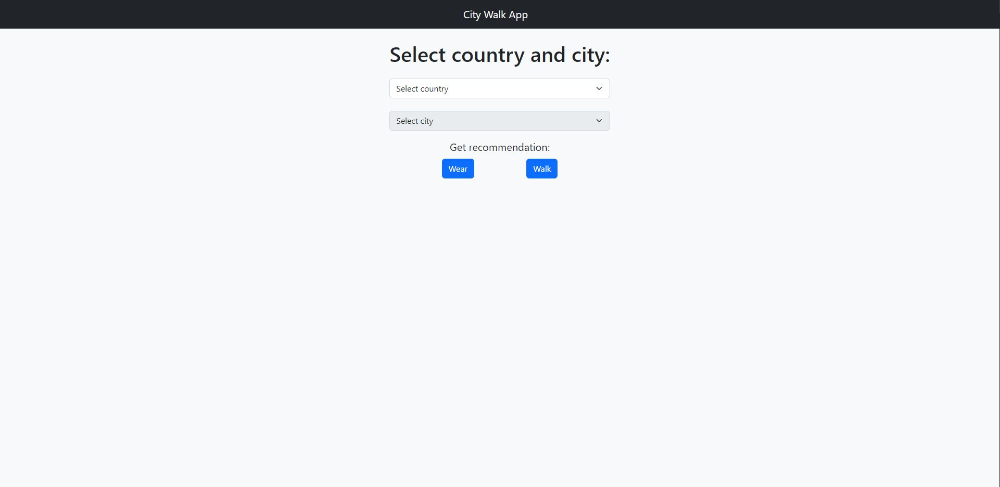

# City Walk App Simple Frontend

Here is a simple example of how to use the [**City Walk App**](https://github.com/viepovsky/City-Walk-App) to get wear and walk information. 
The page is hosted on GitHub Pages, and you can access it here: [viepovsky.github.io](https://viepovsky.github.io)

Please note that the application is hosted on the free version of Replit, so it may be asleep until it receives a request. 
The initial call to the API may take some time.

Please also keep in mind that the application's appearance is basic, but it is fully functional.

# Application view

### Main view

### Walk recommendation

### Wear recommendation

